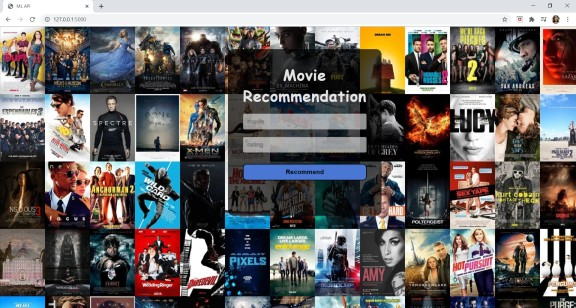

# Movie-Recommendation-Flask-App
This machine learning project is a Flask Web Application that uses collaborative item-to-item filtering to recommend suitable movies based on user’s rating of a previously watched movie.

